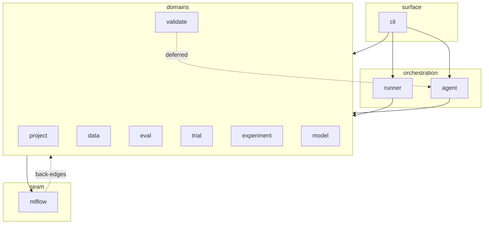

# Architecture — current state

> **What this is:** a verified snapshot of how the code is actually organized
> today, read back against the design principles in
> [`CLAUDE.md`](../CLAUDE.md). Where the principles say what we intend and
> why, this says what is — including where the two disagree. Expect it to drift as the code moves; regenerate before
> trusting details.
>
> **As of:** 2026-06-03 (commit `7524078`, working tree). Method: AST scan of
> every `automl/**/*.py`, collecting internal `automl.*` imports at package
> granularity and classifying each as *module-level* or *deferred* (inside a
> function — usually a deliberate cycle-break).

## The layer roster

Who lives at each altitude today:

| Layer | Package | Role | Size |
|---|---|---|---|
| **Leaves** | `utils` | hashing, slugs, paths, logging, io | 7 files, ~350 loc |
| | `errors` | the exception taxonomy | 1 file, ~60 loc |
| **Seam** | `mlflow` | the single place that talks to MLflow: client, routing, tags, artifact paths | 27 files, ~3,100 loc |
| **Domains** | `project` | recipe loading, session, config, scaffold, overview | 12 files, ~1,750 loc |
| | `data` | dataset specs, sources, materialization | 14 files, ~1,900 loc |
| | `eval` | metrics, evaluation, prediction versioning | 9 files, ~1,600 loc |
| | `trial` | trial creation, manifest, packaging, fork | 11 files, ~1,000 loc |
| | `experiment` | experiment store, leaderboard, cleanup | 10 files, ~450 loc |
| | `model` | model contract, packaging, preprocessing | 5 files, ~350 loc |
| | `validate` | contract checks (project, model, targets, synthetic) | 4 files, ~270 loc |
| **Orchestration** | `runner` | executes one trial end-to-end, logs artifacts | 14 files, ~2,300 loc |
| | `agent` | drives the loop: launch, proposal, proposer context | 12 files, ~2,000 loc |
| **Surface** | `cli` | argument parsing + library calls | 12 files, ~740 loc |

## The import graph

Package-level edges. **Deferred** = imported inside a function, not at module
top — the mechanism used to break load-time cycles. Edges to the leaves
(`utils`, `errors`) are omitted from the diagram for readability; the table
below is complete.

Full edge list (`→` module-level, `⇢` deferred-only, counts are import
statements):

| From | Depends on |
|---|---|
| `utils` | — |
| `errors` | — |
| `mlflow` | errors→18, utils→6, trial→3, eval→2, project→2, experiment→1(+1 def), data⇢2 |
| `project` | errors→4, mlflow→3(+3 def), trial→1, validate→1, utils→1(+1 def) |
| `data` | mlflow→9(+3 def), project→6, utils→5, errors→4 |
| `eval` | mlflow→8, project→8, data→2, utils→2, errors→1 |
| `trial` | mlflow→8, project→6, eval→1(+1 def), errors→1, utils→1 |
| `experiment` | mlflow→9, project→7, trial→3 |
| `model` | errors→1, project→1, validate→1 |
| `validate` | data→1, project⇢2, agent⇢1, model⇢1 |
| `runner` | mlflow→21, data→5, project→4, trial→4, eval→2, errors→3, model→1, validate→1, utils→1 |
| `agent` | mlflow→11(+2 def), project→7, data→2, utils→2, experiment→1, model→1, trial→1, validate→1 |
| `cli` | agent→5(+1 def), experiment→4, trial→4, validate→4, project→3, runner→3, data→1, eval→1, errors→1, mlflow→1 |

Most-depended-on (inbound, distinct packages):

| Package | Inbound | Imported by |
|---|---|---|
| `project` | 10 | everything except utils/errors/itself |
| `mlflow` | 8 | all domains + orchestration + cli |
| `errors` | 8 | most packages |
| `utils` | 7 | most packages |
| `data`, `trial` | 6 | domains + orchestration |
| `validate` | 5 | agent, cli, model, project, runner |

## Reading it back against the design principles

**Surfaces are thin — holds.** `cli` is the smallest
substantive package (~740 loc across 12 files, mostly arg parsing and
`_*_actions` dispatch); it imports everything and nothing imports it. Skills
reach the system only through the CLI (pinned by contract tests).

**Imports point downward — holds at the edges, not in the middle.**

- The leaves are genuinely clean: `utils` and `errors` import nothing
  internal.
- `runner` and `agent` sit high as intended: `runner` is imported only by
  `cli`; `agent` only by `cli` and one deferred edge from `validate`.
- The middle is a **co-dependent core**, not a stack. The seam and the
  domains import each other in both directions at module level:
  `mlflow ↔ eval`, `mlflow ↔ experiment`, `mlflow ↔ project`,
  `mlflow ↔ trial` (mutual, module-level); `mlflow ↔ data` (data side
  module-level, mlflow side deferred); `project ↔ trial` and
  `project ↔ validate` (mutual). These load because the cycles cross
  different submodules; the deferred imports are where that wasn't enough.

**Known deviations from the designed altitude:**

- **`validate` is not low-level today.** It reaches *up* into `agent`,
  `model`, and `project` (deferred) and `data` (module-level) to run its
  checks. The design intent — validation primitives low, each domain owning
  its contract — would have those checks live with their domains or have
  `validate` depend only on contract shapes.
- **`project` is a de facto leaf.** With 10 inbound edges it is the most
  depended-on package in the library — every domain pulls it in for
  `Session`/config. In practice it behaves like low-level context
  infrastructure wearing a domain noun's name.
- **Deferred imports as cycle-breaks** (the debt the principles acknowledge):
  `mlflow⇢data`, `project⇢mlflow`, `validate⇢{agent, model, project}`,
  `trial⇢eval`, `cli⇢agent`, `agent⇢mlflow`, `data⇢mlflow`,
  `mlflow⇢experiment`.

**One home per noun — holds.** Project, Dataset (`data`), Experiment, Trial,
Model each resolve to exactly one package; Proposal lives in
`agent/proposal.py` as part of the loop rather than as its own package.

## Regenerating this snapshot

The numbers above come from a package-granularity AST scan of internal
imports (module-level vs deferred classified by whether the import statement
sits inside a function). Re-run the scan and refresh the tables whenever the
graph matters for a decision — this file records a moment, not a contract.
